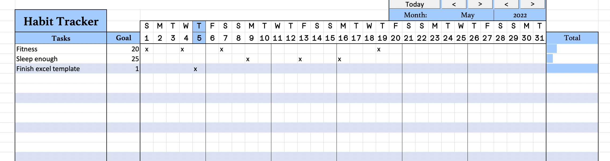

# Habits tracker excel

Many already exist - but none is free and how I wanted it - so I made one myself.

## How to use
Insert the tasks in the column on the left. You can add up to 40 activities.

Insert any character on the days you've done that task.

Use the buttons on top to change month / year.

## How it works

A hidden sheet holds all data - by pressing the buttons a macro is triggered which shows the correct portion of that sheet.
 Additionally, if the selected month and year are the current ones, today's date is highlighted.

With a formula we can also get the first letter of the weekday:
`=LEFT(TEXT(DATEVALUE((COLUMN()-3) & " " &  AA2 & " " &AE2);"ddd");1)`

And with some conditional formatting the bar on the right shows the progress of each task.

## License

Use this how you want, just give credits

---
Donations are welcome!

